# Project 3-1 Write-up

### Author: Li TIan, Yuqi Hu 

## Part I: Ray Generation and Scene Intersection

- **Walk through the ray generation and primitive intersection parts of the rendering pipeline.**

​	In `Camera::generate_ray`, the new postion of the point is generated via a coordinate change including shifiting, saling, and rotation. A normalization is then performed to the vector. 

​	In `PathTracer::raytrace_pixel`, to estimate the integral of radiance over a pixel, Monte Carlo algorithm is performed. A loop is used to generate and iterate over all samples. In the loop, each step, we call the previously implemented function `Camera::generate_ray` to generate the ray of the sample. Meanwhile, we keep track of the illuminance of the pixel by `est_radiance_global_illumination`, and finally fill the buffer by the sum of the illuminance divided by the number of the sample.

​	In `Triangle::has_intersection`, Moller Trumbore Algorithm is carried out. Based on the algorithm, we utilize three vertices of the triangle, origin position, and ray direction to calculate the intersection time and two of the baraycentric coordinates of the intersection point given the triangle. If the time of intersection is not in the range of `max_t` and `min_t`, which is then not intersected. Meanwhile, if the three barycentric value if not in `(0, 1)`, which also means that the ray does not intersect the triangle.

​	In `Triangle::intersect`, like the process in `Triangle::has_intersection`. If the ray intersects the triangle, then keep track of the itersection's information of intersection time, normal of the triangle, the triangle primitive, and the Bidirectional Scattering Distribution Function (bdsf).

- **Explain the triangle intersection algorithm you implemented in your own words.**

​	Given input of the three vertices of a triangle, the position and the direction of the ray, and a range of available intersection time period, we employ Moller Trumbore Algorithm to solve the problem. The primitive idea is having the plane equation and the ray equation so that we can find the itersection time so that taken the itersection time into the ray and get the intersection point. However, Moller Trumbore Algorithm optimizes the process. Firstly, two edge vectors are generated through the three vertices of the triangle, say $E_1$ and $E_2$. Also, assign the vector from the sharing vertices of  $E_1$ and $E_2$ to the origin to $S$. We then get $S_1$ by cross producting the direction of the ray and $E_2$, and $S_2$ by cross producting $S$ and $E_1$. In final, the result $[t, b_1, b_2]$ is gained by $\frac{1}{\vec{S_1}\cdot\vec{E_1}}[\vec{S_2}\cdot\vec{E_2}, \vec{S_1}\cdot\vec{S}, \vec{S_2}\cdot\vec{D}]$, where $\vec{D}$ is the direction of the ray.

- **Show images with normal shading for a few small *.dae* files.**	

  
  

	

  
  
 

## Part II: Bounding Volume Hierarchy

- **Walk through your BVH construction algorithm. Explain the heuristic you chose for picking the splitting point.**

​	In `*BVHAccel::construct_bvh`, a recursively called function is implemented. For each call, the terminal case will be the total number of the primitives is lower than the level of `max_leaf_size`. If it is true, form a leaf node and return, or keep going. We then find the union (smallest bounding box that covers all the primitives) and measure the union's length in each x, y, and z dimension. Pick the longest side of the bounding box, and we will divide the nodes along this axis. The spliting value will be made by averaging the centroids of all the primitives, and primitives with smaller centroids value will be splitted to the left node and vice versa. Considering the case that all the centroids are aligned on the spliting plane (extreme, but possible). Then, one side of the node will be empty, which will cause infinitely call the recursive function. To deal this case, an primitive that is closest to the splitting plane is thus forced to splitted to the other node, filling the emptiness and ending the infinitely recursive call. At the very end, run the same process on the left node and the right node of the current node.

​	In `BBox::intersect`, the ranges of intersection time that the ray goes through each pair of slabs of the bounding box are calculated. Then, we choose the tightest bound of the intersection time (smallest of all the max intersection time, and the largest of all the min intersection time). If the minMax time smaller than maxMin time, then the range is geometrically false, saying that the ray does not go through the bounding box.

​	In `BVHAccel::has_intersection`, if ray does not intersect the bounding box, return false. If so, then go though the tightest bounding box in the node and iterate through all the primitives see if there is an intersection. Return true immediately is there exists.

​	In `BVHAccel::intersection`, similar to `BVHAccel::has_intersection` but additionally go through all the primitives so that the min and max time will be updated.

- **Show images with normal shading for a few large *.dae* files that you can only render with BVH acceleration.**

  
  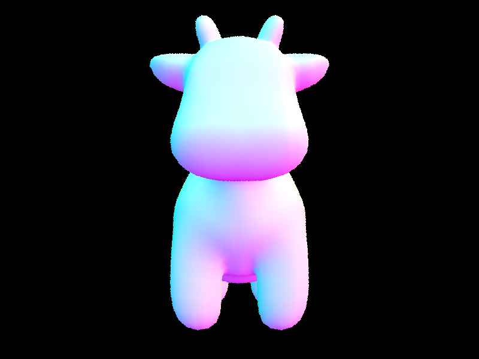
  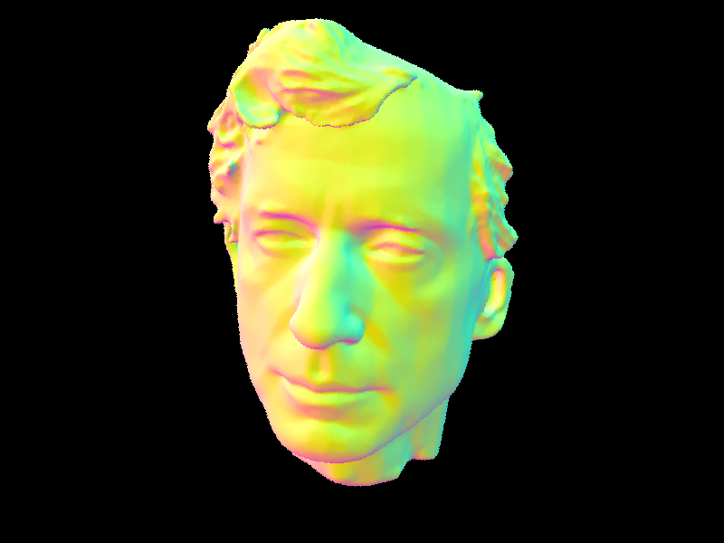

	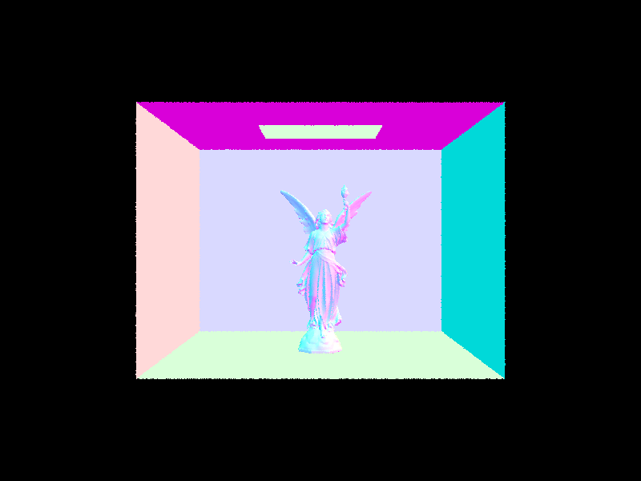
  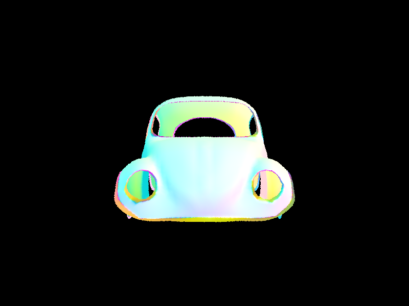

  
  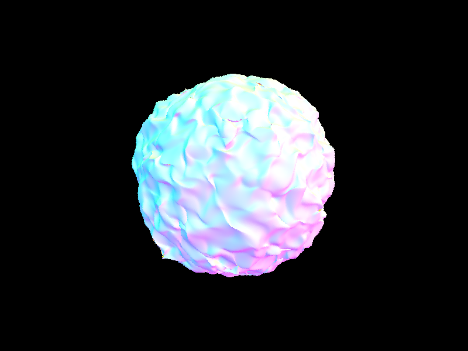
  
 

- **Compare rendering times on a few scenes with moderately complex geometries with and without BVH acceleration. Present your results in a one-paragraph analysis.**

  On MacOS Intel Core i7® with 8 threads using, without the BVH construction, the cow MaxPlanck image takes about 1 minutes to render; however, after the implementation of the BVH, the rendering only takes about 1 seconds. The major cause of the reduction in rendering time can be explained by the distribution of the primitives. It is clear that the primitives are generally similar sized triangles arrange in a large space. With BVH, those emptiness will not be considered of intersection. This huge amount of saving time leads to the significant speeding up.

##  Part III: Direct Illumination

* **Walk through both implementations of the direct lighting function.**

  * With Uniform Hemisphere Sampling

    In `estimate_direct_lighting_hemisphere`, I sample `num_samples`(provided) times from the hemisphere, and use `o2w` to map it to world space. After that, I create a new sample ray with origin around hit point `hit_p` and direction of the solid angle I just sampled. We also have to call `BVHAccel::intersect` to check if there are any intersections and get the metadata for the intersection. Then, with the Monte Carlo estimator in the lecture slides, we use the following formula to calculate the radiance from each sample and sum them up.

    `intersection.bsdf->get_emission() * isect.bsdf->f(w_out, w_in) * cos(wi) * 2pi / num_samples`

  * With Importance Sampling Lights

    In `estimate_direct_lighting_importance`, I sample only rays towards lights. I sample once for point light sources and `ns_area_light` times for non-point light sources. We still call `BVHAccel::intersect`, but this time to detect there are any obstacles between the light source and the hit point. If it returns `false`, then we use the following formula to calculate the radiance from the each light source sample and sum them up. Notice `num_samples` is 1 for point light sources and `ns_area_light` for other light sources.

    `sample * isect.bsdf->f(w_out, w_in) * cos(wi) / pdf / num_samples`

* **Show some images rendered with both implementations of the direct lighting function.**

  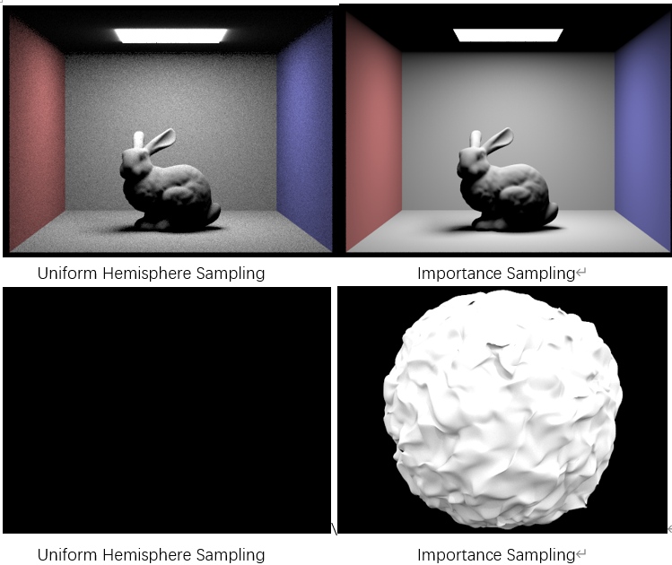

* **Focus on one particular scene with at least one area light and compare the noise levels in soft shadows when rendering with 1, 4, 16, and 64 light rays (the `-l` flag) and with 1 sample per pixel (the `-s` flag) using light sampling, not uniform hemisphere sampling.**

  As shown below, the noise levels decrease as the light rays increase. I think this is because when there are small number of light rays, the Monto Carlo estimator tends to have higher variance, and thus making some noise. 

  

* **Compare the results between uniform hemisphere sampling and lighting sampling in a one-paragraph analysis.**

  The results from uniform hemisphere sampling obviously have more noise than the result from importance light sampling. The difference is most obvious on walls of the bunny image. This is because light sampling only sampling rays towards the lights while uniform hemisphere sampling samples from all directions. The hemisphere sampling samples will have a proportion of the samples being useless if there are not light sources in the sample direction, thus producing less useful samples. In contrast, light sampling only samples towards the lights and gives apparently more useful samples.

## Part IV: Global Illumination

- **Walk through your implementation of the indirect lighting function.**

  In the function `at_least_one_bounce_radiance`, we first call `one_bounce_radiance` to get the radiances from one bounce.  To implement Russian Roulette, we also set a variable `continuingProb` to be 0.65. Then there are two conditions:

  1. When `r.depth` already reaches `max_ray_depth`, we simply return the result of `one_bounce_radiance`

  2. If 1 is not correct, meaning we haven't reached `max_ray_depth`. Then when `coin_flip(continuingProb)` returns true, meaning that Russian Roulette tells us to continue bouncing, then we would generate another ray from the current ray and check for this new ray's intersection. If it does have an intersection with an object, I would recursively call `at_least_one_bounce_radiance` on this ray.

     Then we multiply the result of this recursion call by `bsdf->sample_f(w_out, w_in, pdf)* cos(w_in) / pdf / continuingProb` and add it to the result `one_bounce_radiance` to get `L_out`

- **Show some images rendered with global (direct and indirect) illumination. Use 1024 samples per pixel.**

  

- **Pick one scene and compare rendered views first with only direct illumination, then only indirect illumination. Use 1024 samples per pixel. (You will have to edit `PathTracer::at_least_one_bounce_radiance(...)` in your code to generate these views.)**

  

  With Only direct lighting, the ceiling is completely dark since it's on the same surface as the light. Similarly the parts on the spheres that cannot directly be bounced from to the light source will be dark. Also there's no traces of the spheres on the wall with only one bounce rays and zero bounce rays.

  With only indirect lighting, the first thing to notice is the light source above is completely dark, resulting from not using zero bounce light, then it also seems like that light is coming from nowhere and the top of the spheres are darker than the bottom. This are results of only rendering rays that got bounced multiple times to the light. Another difference is that we can see the shadows of the spheres on the wall, also resulting from rays of multiple bounces.

- **For *CBbunny.dae*, compare rendered views with `max_ray_depth` set to 0, 1, 2, 3, and 100 (the `-m` flag). Use 1024 samples per pixel.**

  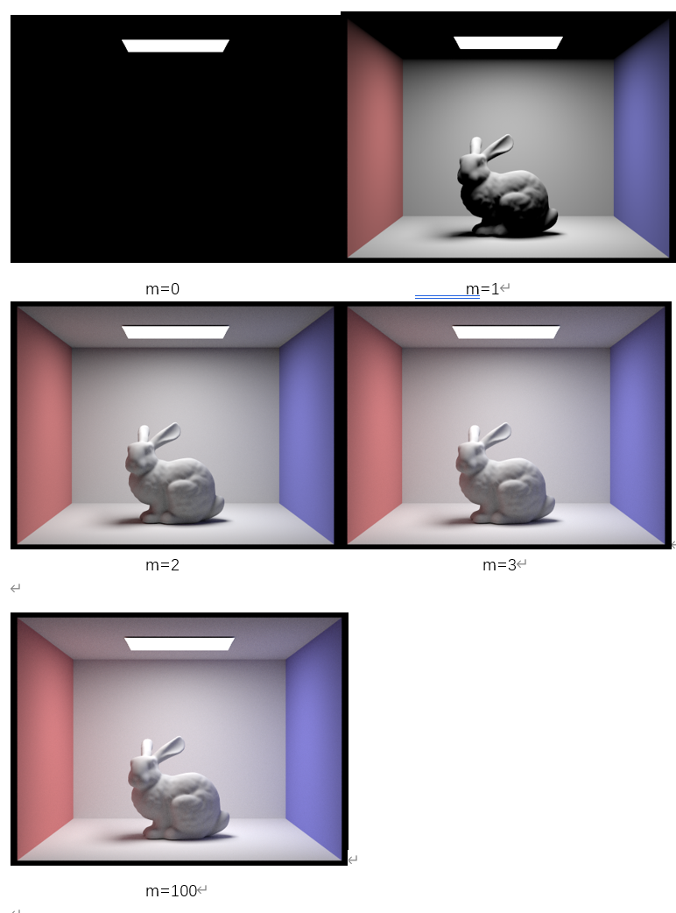

  - m=0, we only see light sources as we only observe zero bounce light.
  - m=1, only direct illumination is observed. 
  - m=2, 3,100. We can slightly see difference between m=2 and m=100 but actually the differences between 2,3 and between 3,100 are very obvious. I suppose that's because with a continuing probability of 0.65, each ray has an expectation of roughly only 1.55 bounces.

- **Pick one scene and compare rendered views with various sample-per-pixel rates, including at least 1, 2, 4, 8, 16, 64, and 1024. Use 4 light rays.**

  

  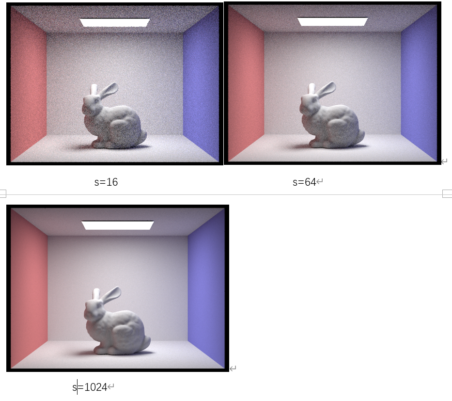

  We observe that noise level decrease as sample-per-pixel rates increase. 

## Part V: Adaptive Sampling

- **Walk through your implementation of the adaptive sampling.**

​	In this section, $s_1$ and $s_2$ are kept tracked thoughout the loop. Whenver the ray vector is gained, its illuminance will be caculated and sum it and its square respectively to $s_1$ and $s_2$. When the iteration number reaches a multiple of batch numbers, a comparison between $I$ and $maxTolerance \cdot \mu$ will be made. We implemented by the comparison between the square of each side so that no square root will be calculated, and the precision may be preserved. In case the comparison passes, we average the 3D vector by the real sample number.  

- **Pick one scene and render it with at least 2048 samples per pixel. Show a good sampling rate image with clearly visible differences in sampling rate over various regions and pixels. Include both your sample rate image, which shows your how your adaptive sampling changes depending on which part of the image you are rendering, and your noise-free rendered result. Use 1 sample per light and at least 5 for max ray depth.**

  
  

	
  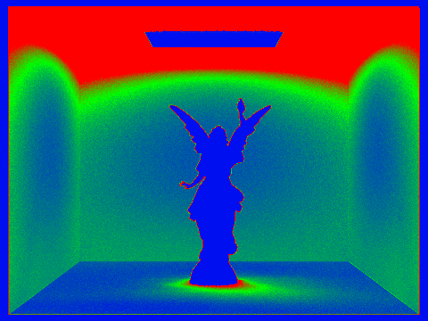

  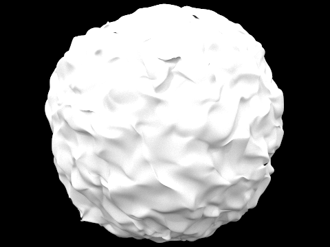
  
 

  
  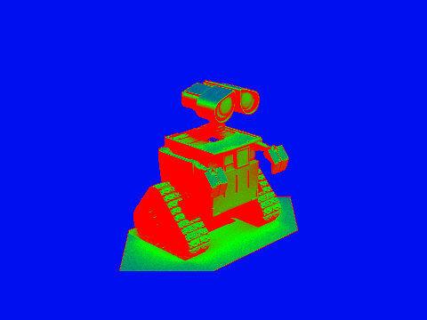
 

## Link

https://cal-cs184-student.github.io/sp22-project-webpages-TianCal/

## Collaboration

In this project, Li and Yuqi together managed to finish Part 1, 2, 3, 4, and 5. When Li programed, Yuqi wrote the report; when Yuqi did code, Li handled the walkthrough. Meanwhile, for part 3, 4, 5, Yuqi and Li both contributed computing power for the heavy rendering processes. Overall, this project brought us deeper understanding in the ray tracing.