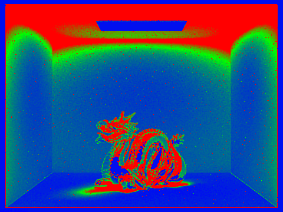
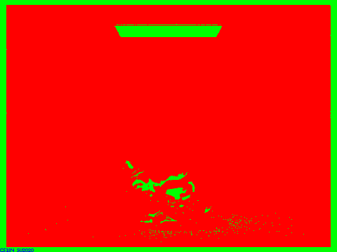

# Reflection on Project 3-2: Pathtracer 2

### Author: Li Tian, Yuqi Hu

## Part I

* **Implementation details for new materials**

  * Mirror

    Firstly, I implemented the `BSDF::reflect` function, which simply assigns the reflection of `wo` about surface normal to `wi`.  We simply assign `(-wo.x, -wo.y, wo.z)` to `wi`. 

    For `MirrorBSDF::sample_f`, we assign 1 to `pdf` and call `reflect` on `wo` and `wi` to assign the reflection of `wo` to `wi`. We then return the `reflectance` divided by `abs_cos_theta(*wi)`  to cancel out the cosine that will later by multiplied by `at_least_one_bounce_radiance`.

  * Glass

    Firstly, I implemented the `BSDF::refract` function with Snell's equations. We assign the refraction of `wo` to `wi` . We return true if there's refraction happening and false otherwise.

    For `RefractionBSDF::sample_f`, we call `BSDF::refract` to determine if there's refraction. If there is refraction, we simply return `transmittance / (eta * eta) / abs_cos_theta(*wi)` where `eta` is index of refraction when exiting and reciprocal of ior when entering.

    For `GlassBSDF::sample_f`, we use Schlick's approximation to decide the ratio of reflection and refraction in glass.  We then simply follow the logic defined in spec. 

            <table style="width=100%">
                <tr>
                    <td align="middle">
                    
                    <figcaption align="middle">m = 0</figcaption>
                    <td align="middle">
                    
                    <figcaption align="middle">m = 1</figcaption>
                </tr>
                <tr>
                    <td align="middle">
                        
                        <figcaption align="middle">m = 2</figcaption>
                    <td align="middle">
                        
                        <figcaption align="middle">m = 3</figcaption>
                </tr>
                <tr>
                    <td align="middle">
                        
                        <figcaption align="middle">m = 4</figcaption>
                    <td align="middle">
                        
                        <figcaption align="middle">m = 5</figcaption>
                </tr>
                <tr>
                    <td align="middle">
                        
                        <figcaption align="middle">m = 100</figcaption>
                </tr>
            </table>

* m = 0, we can only see the light source since that's the only zero-bounce light.

* m = 1, we begin to see the walls and a small portion of the sphere reflecting the light from light source to the camera. The rest part of the sphere are dark since they won't be able to reflect light from the light source, and we only allow at most 1-bounce lights.

* m = 2, we can see the mirror sphere is rendered as well as the ceiling. The ceiling gets two-bounce lights from the walls and spheres so we can see it.  Similarly, the mirror sphere gets the 2-bounce lights from the other sphere, the walls and the ceiling. However, the ceiling reflected in the sphere is still dark because the sphere is reflecting from a space with only 1-bounce lights.

* m = 3, we can see the glass sphere with refraction, this is because as we allow 3-bounce lights. Rays can go into the sphere, go out of the sphere, go on to the walls, and gets to the camera. 

* m = 4, the only obvious difference is that there is a small light spot on the right wall. This it because rays go to the mirror sphere and get reflected into the glass sphere and then onto the wall, and then the camera.

* m = 5, we see no obvious difference. The multibounce effects should already nearly converge.

* m = 100, we still see no obvious differences either.

  

## Part II

- In this part, we built `MicrofacetBSDF::f()` with `MicrofacetBSDF::G()`, `MicrofacetBSDF::G()`, `MicrofacetBSDF::D()`. Each funtion is respectively built according to given formula in Part 2. Considering the importance sampling, we built `MicrofacetBSDF::sample_f()`. The most tricky part is given the `h` and `wo`, we have to find the `wi` by $wi = - wo + 2*(wo \cdot h) * h$. 

- In this part, all images are rendered by 1024 samples per pixel and 4 samples per light. The number of bounces is set to 7. It can be shown that the $\alpha$ the smaller, the smoother the dragon is; thus, the smoother dragon is more like a mirror, and the tought one can better diffuse the light.

	
  

	
  

	
  
	
  

- In this part, all images are rendered by 64 samples per pixel and 1 sample per light. The number of bounces is set to 7. The importance sampled one not only with less computation but also has higher quality due to the faster convergence speed brought by the sampling method.

	
  

	
  

- Show at least one image with some other conductor material, replacing `eta` and `k`. Note that you should look up values for real data rather than modifying them arbitrarily. Tell us what kind of material your parameters correspond to

	
  
  

<table border="none">
  <tr>
    <td align="center" border="none" width="33%">Cu</td>
    <td align="center" border="none" width="33%">Al</td>
    <td align="center" border="none" width="33%">Ag</td>
  </tr>
  <tr>
    <td border="none" width="33%">n = 0.25466, 1.0162, 1.2474</td>
    <td border="none" width="33%">n = 1.5006, 1.0109, 0.68955</td>
    <td border="none" width="33%">n = 0.054333, 0.059881, 0.047366</td>
  </tr>
  <tr>
    <td border="none" width="33%">k = 3.5122, 2.5785, 2.4603</td>
    <td border="none" width="33%">k = 7.6205, 6.6157, 5.6471</td>
    <td border="none" width="33%">k = 4.3396, 3.5892, 2.8132</td>
  </tr>
</table>

  
  
  

<table border="none">
  <tr>
    <td align="center" border="none" width="33%">Au</td>
    <td align="center" border="none" width="33%">Ti</td>
    <td align="center" border="none" width="33%">Fe</td>
  </tr>
  <tr>
    <td border="none" width="33%">n = 0.17033, 0.42833, 1.3284</td>
    <td border="none" width="33%">n = 2.6640, 2.5400, 2.3075</td>
    <td border="none" width="33%">n = 1.0671, 0.65850, 0.42092</td>
  </tr>
  <tr>
    <td border="none" width="33%">k = 3.5129, 2.4599, 1.8661</td>
    <td border="none" width="33%">k = 3.7080, 3.4300, 3.0850</td>
    <td border="none" width="33%">k = 6.4018, 5.6248, 4.6673</td>
  </tr>
</table>

  
  
  

<table border="none">
  <tr>
    <td align="center" border="none" width="33%">Pb</td>
    <td align="center" border="none" width="33%">Ca</td>
    <td align="center" border="none" width="33%">Co</td>
  </tr>
  <tr>
    <td border="none" width="33%">n = 1.0671, 0.65850, 0.42092</td>
    <td border="none" width="33%">n = 1.5006, 1.0109, 0.68955</td>
    <td border="none" width="33%">n = 2.1849, 2.0500, 1.7925</td>
  </tr>
  <tr>
    <td border="none" width="33%">k = 6.4018, 5.6248, 4.6673</td>
    <td border="none" width="33%">k = 2.7181, 2.3479, 1.8333</td>
    <td border="none" width="33%">k = 4.0971, 3.8200, 3.3775</td>
  </tr>
</table>

## Collaboration

In this project, Yuqi Hu and Li Tian together finished Part I and Part II. Even though Li Tian mainly focused on Part 1 and Yuqi Hu implemented Part 2 more, they both understand each other's implementation of this project. Meanwhile, they both contribute their calculation force for the final rendering of in borth parts. 

## Link

https://cal-cs184-student.github.io/sp22-project-webpages-TianCal/