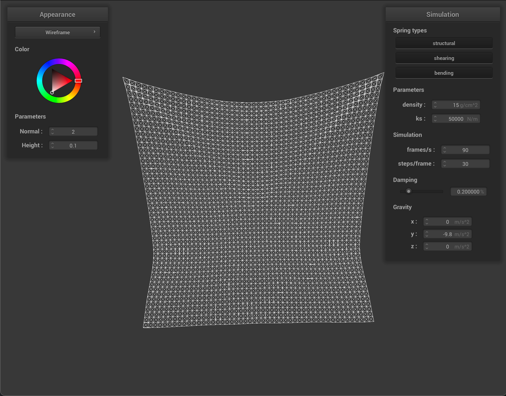
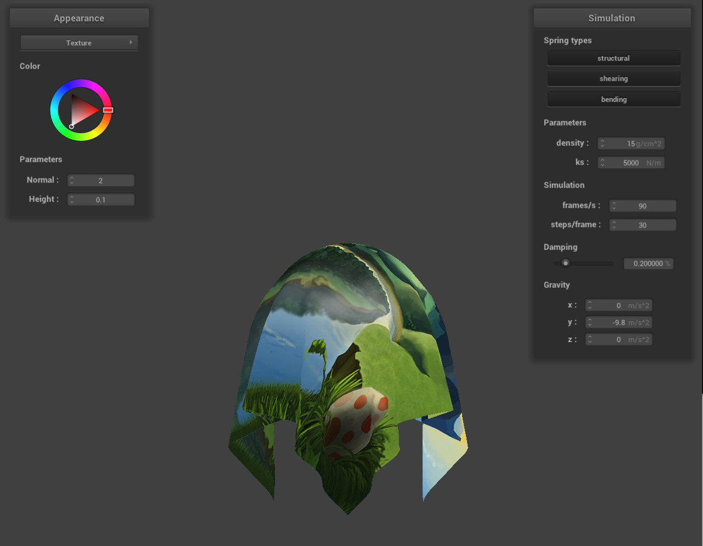
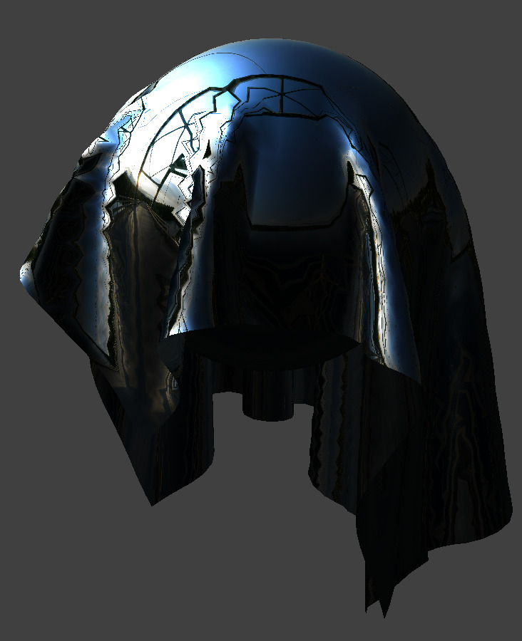

# Reflection on Project 4

### Author: Li Tian, Yuqi Hu

## Overview

In this project, we build the cloth simulator with point masses and springs.  Specific implementation details are as below:

* Part 1: We build a grid of masses firstly to represent each section of the cloth, and then with the masses, we build a grid of three types of springs (structural, shearing, bending) to connect each group of masses.
* Part 2: In this part, we simulate every mass point of the cloth considering all the acceleration it has like the gravity and spring force. Also, to prevent super elastic, we add limitations on the movement of the mass points.
* Part 3: We mainly processed the collisions of cloth with spheres and planes. For spheres, if we realized that currently the cloth is intersecting or is inside the sphere, we just add a correction term to the position scaled by (1 - f). For planes, we did a similar process.
* Part 4: We also need to handle self-collisions for cloths. We first hash every point mass into a spatial hashmap, and with the hashmap we find every point mass that's within $2 * thickness$ distance of the current point mass and correct them by a correction vector.
* Part 5: In this part, we created different kinds of shading implemented in project 3-1. Also, we implemented texture map and displacement effect. Fianlly, combined previous parts, we create our own custom effect.

## Part 1

- Take some screenshots of *scene/pinned2.json* from a viewing angle where you can clearly see the cloth wireframe to show the structure of your point masses and springs.
- Show us what the wireframe looks like (1) without any shearing constraints, (2) with only shearing constraints, and (3) with all constraints.

            <table style="width=100%">
                <tr>
                    <td align="middle">
                    	
                    	<figcaption align="middle">No shearing</figcaption>
                </tr>
                <tr>
                    <td align="middle">
                    	
                    	<figcaption align="middle">Only shearing</figcaption>
                </tr>
                <tr>
                    <td align="middle">
                        
                        <figcaption align="middle">All constraints</figcaption>
                </tr>
                <tr>
                    <td align="middle">
                        
                        <figcaption align="middle">All constraints</figcaption>
                </tr>
            </table>

## PART 2

- Describe the effects of changing the spring constant `ks`; how does the cloth behave from start to rest with a very low `ks`? A high `ks`?
  - With a low `ks`, the cloth falls more softly as the spring force exerted less on the cloth itself; however, with a high `ks` the cloth keeps flat even when it falls.

	
  

- What about for `density`?
  - Higher density leads to a greater overall mass, and thus the resting position is lower. Less density leads to less mass, and thus the resting position is higher.

	
  

- What about for `damping`?
  - With higher damping, the falling process is overall slow and smoother since the spring does less effect. However, with small damping, not only the falling process is drastic but also the surface of the cloth is way too elastic.

	
  

- Rest state of the cloth.

	
  

## Part 3

- Show us screenshots of your shaded cloth from *scene/sphere.json* in its final resting state on the sphere using the default `ks = 5000` as well as with `ks = 500` and `ks = 50000`. Describe the differences in the results.
- Show us a screenshot of your shaded cloth lying peacefully at rest on the plane. If you haven't by now, feel free to express your colorful creativity with the cloth! (You will need to complete Part 5 first to show custom colors for anything but the "Wireframe" material.)

            <table style="width=100%">
                <tr>
                    <td align="middle">
                    	
                    	<figcaption align="middle">ks 500</figcaption>
                </tr>
                <tr>
                    <td align="middle">
                    	
                    	<figcaption align="middle">ks 5000</figcaption>
                </tr>
                <tr>
                    <td align="middle">
                        
                        <figcaption align="middle">ks 50000</figcaption>
                </tr>
                <tr>
                    <td align="middle">
                        
                        <figcaption align="middle">Shaded Cloth</figcaption>
                </tr>
            </table>

With a higher ks, the cloth seems less soft and cannot hang vertically as the cloth with a lower ks resulting from a higher spring tension.

## Part 4

- Show us at least 3 screenshots that document how your cloth falls and folds on itself, starting with an early, initial self-collision and ending with the cloth at a more restful state (even if it is still slightly bouncy on the ground).
- Vary the `density` as well as `ks` and describe with words and screenshots how they affect the behavior of the cloth as it falls on itself.

            <table style="width=100%">
                <tr>
                    <td align="middle">
                    	
                    	<figcaption align="middle">Default params</figcaption>
                    <td align="middle">
                    	
                    	<figcaption align="middle">Default params</figcaption>
                    <td align="middle">
                        
                        <figcaption align="middle">Default params</figcaption>
                </tr>
            </table>

            <table style="width=100%">
                <tr>
                    <td align="middle">
                    	
                    	<figcaption align="middle">10 times density (150)</figcaption>
                    <td align="middle">
                    	
                    	<figcaption align="middle">10 times density (150)</figcaption>
                    <td align="middle">
                        
                        <figcaption align="middle">10 times density (150)</figcaption>   
            </table>

            <table style="width=100%">
                <tr>
                    <td align="middle">
                    	
                    	<figcaption align="middle">10 times ks (50000)</figcaption>
                    <td align="middle">
                    	
                    	<figcaption align="middle">10 times ks (50000)</figcaption>  
                     <td align="middle">
                        
                        <figcaption align="middle">10 times ks (50000)</figcaption>       
            </table>

* 10 times density: With higher density, it is obvious that the cloth has more wrinkles  while falling down and while at rest state. It makes sense since when each point mass is heavier and will be more "independent" from each other.
* 10 times ks: With higher ks, we see much fewer wrinkles while falling down and it feels more bouncy when at the ground.

## Part 5

- Explain in your own words what is a shader program and how vertex and fragment shaders work together to create lighting and material effects.

  A shader program is  just a program inside graphics pipelines that transforms from inputs to outputs. Vertex shaders modify vertices by transforming them. Fragment shaders get the vertex information and then compute the colors and textures for each fragment.

- Explain the Blinn-Phong shading model in your own words. Show a screenshot of your Blinn-Phong shader outputting only the ambient component, a screen shot only outputting the diffuse component, a screen shot only outputting the specular component, and one using the entire Blinn-Phong model.

  The Blinn-Phong shading model is basically made up of three parts, respectively ambient, specular, and diffusive model. Sum the result of these models and result to the Blini-Phong model result.

  

              <table style="width=100%">
                  <tr>
                      <td align="middle">
                      	
                      	<figcaption align="middle">Ambient</figcaption>
                      <td align="middle">
                      	
                      	<figcaption align="middle">Diffusive</figcaption>
                  </tr>
                  <tr>
                      <td align="middle">
                      	
                      	<figcaption align="middle">Specular</figcaption>
                      <td align="middle">
                      	
                      	<figcaption align="middle">Blinn-Phong</figcaption>
                  </tr>         
              </table>
  

- Show a screenshot of your texture mapping shader using your own custom texture by modifying the textures in `/textures/`.

  

- Show a screenshot of bump mapping on the cloth and on the sphere. Show a screenshot of displacement mapping on the sphere. Use the same texture for both renders. You can either provide your own texture or use one of the ones in the textures directory, BUT choose one that's not the default `texture_2.png`. Compare the two approaches and resulting renders in your own words. Compare how your the two shaders react to the sphere by changing the sphere mesh's coarseness by using `-o 16 -a 16` and then `-o 128 -a 128`.

  

              <table style="width=100%">
                  <tr>
                      <td align="middle">
                      	
                      	<figcaption align="middle">16x16 Bump</figcaption>
                      <td align="middle">
                      	
                      	<figcaption align="middle">16x16 Bump</figcaption>
                  </tr>
                  <tr>
                      <td align="middle">
                      	
                      	<figcaption align="middle">16x16 Displace</figcaption>
                      <td align="middle">
                      	
                      	<figcaption align="middle">16x16 Displace</figcaption>
                  </tr>       
                  <tr>
                      <td align="middle">
                      	
                      	<figcaption align="middle">128x128 Bump</figcaption>
                      <td align="middle">
                      	
                      	<figcaption align="middle">128x128 Displace</figcaption>
                  </tr>     
              </table>
  

  Bump method  provides us with a more smooth overall shape of the sphere, while Displacement method modified the positions of vertices and made the sphere shape irregular depending on the height map.

  When comparing 128 * 128 spheres with 16 * 16 spheres, we don't see too much difference in Bump method spheres, but we do see a difference in Displacement method spheres, where the sphere is even more irregular when it becomes finer.

- Show a screenshot of your mirror shader on the cloth and on the sphere.

- Explain what you did in your custom shader, if you made one.

  For this part, we combined the Blinn-Phone effect with the Mirror effect by making the result of blinn-Phong result as a mask of the color of the Mirror. As a result, create an effect that shares only by smooth surface (mirror) but also only by rough surface (with Blinn-Phong effect). The mask multiplied the mirror output effect so that the result  of the darker part in the blinn-Phong effect filters the output of the mirror effect's output.

  

## Collaboration

In this project, Li Tian and Yuqi Hu collaboratively completed all the parts. Especially for the part 5, Li did part 1 which contributes to part 2 which Yuqi finished; Yuqi did task 3 which helps task 5 done by Li; they together completed task 4. Overall, the projected is well splited and it is guarateed that both of them learned the whole project.

## Link

https://cal-cs184-student.github.io/sp22-project-webpages-TianCal/